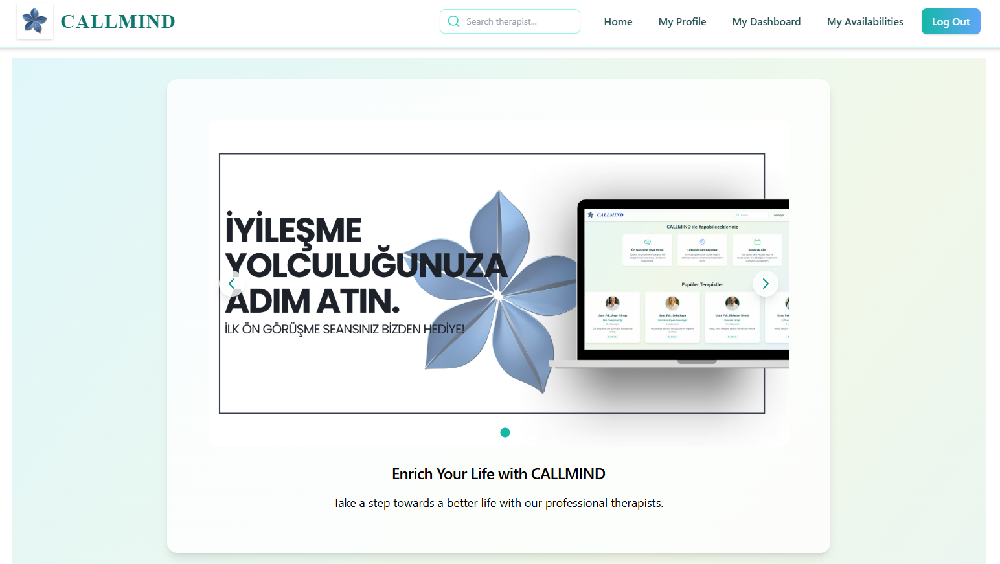
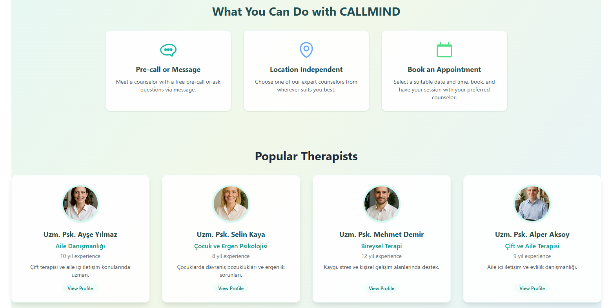
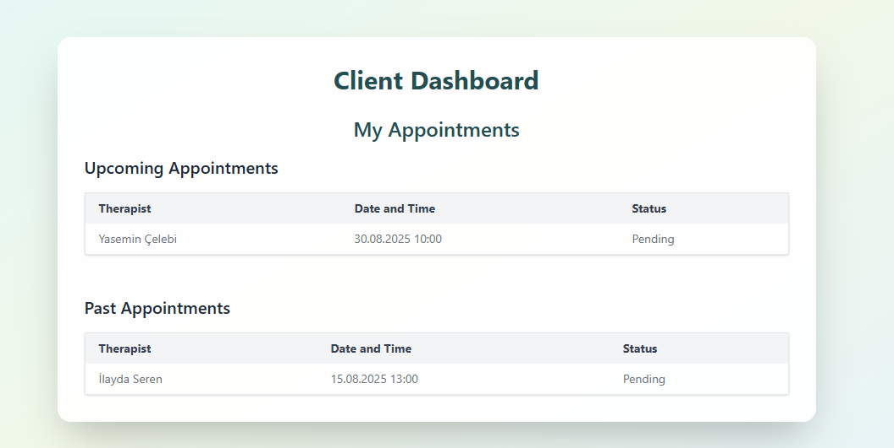
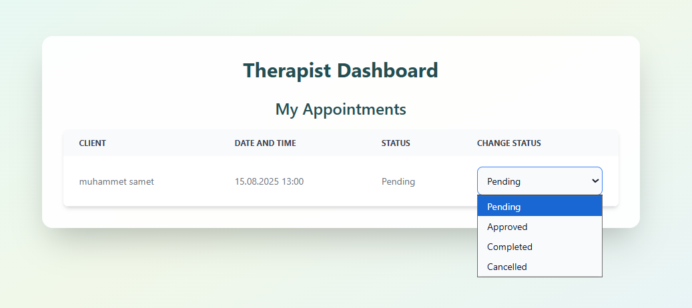
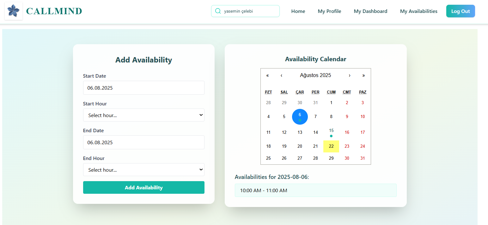
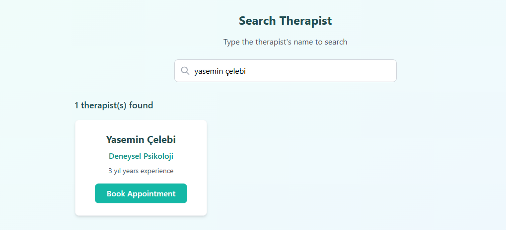
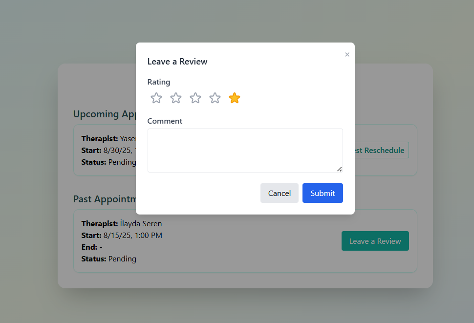

# Psychological Counseling Appointment System

## Project Summary
This project is a **Psychological Counseling Appointment System** designed to facilitate access to psychological counseling services. The system allows **clients** to book online appointments with **therapists** based on the therapists’ availability.

- Therapists define their available dates and time slots.
- Clients select an appointment from the available time slots.
- After the session, clients can leave **feedback** to help improve service quality and support therapists’ development.

---

## Technologies Used
- Backend: **Java Spring Boot**
- Frontend: **React.js**
- Database: **PostgreSQL**
- Authentication: **JWT**
- RESTful API architecture
- Layered architecture principles

---

## Key Features
- User registration and login (Client & Therapist)
- Appointment creation, viewing, and cancellation
- Therapist availability management
- Feedback submission and viewing
- Role-based access control (RBAC)
- Data validation and error handling

---
## Project Screenshots

### Home Page

### Client Dashboard

### Therapist Dashboard

### Therapist Search and Feedback

